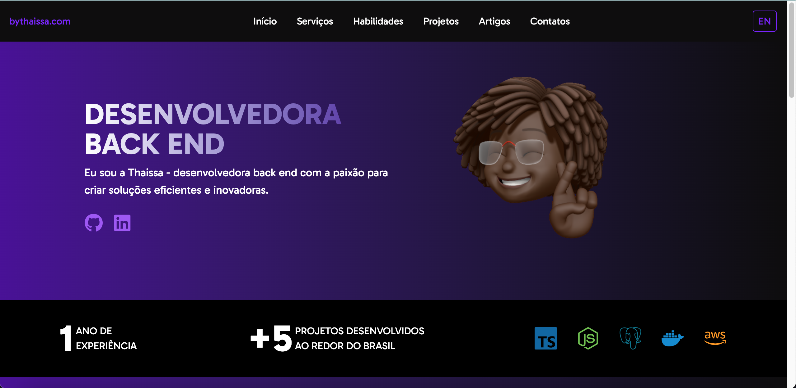

# Multilingual Portfolio Website

A modern, responsive portfolio website for Thaissa Carvalho with internationalization support for English and Portuguese.



## Features

- **Multilingual Support**: Full internationalization with English and Portuguese translations
- **Responsive Design**: Looks great on all devices from mobile to desktop
- **Modern UI**: Clean, professional design with a purple/black color scheme
- **Interactive Components**: Animated navigation, interactive project cards, and contact form
- **SEO Optimized**: Proper metadata and semantic HTML structure
- **Accessibility**: Follows best practices for web accessibility

## Technologies Used

- **Next.js 15+**: React framework with App Router for routing and server components
- **TypeScript**: For type safety and better developer experience
- **Tailwind CSS**: For styling and responsive design
- **i18n**: Custom internationalization implementation with middleware
- **React Icons**: For various icons throughout the site

## Installation

1. Clone the repository:
   ```bash
   git clone https://github.com/thaissacarvalho/portfolio.git
   cd portfolio

Install dependencies:

2. Install Dependencies
   ```bash
   npm install

3. Run the development server:

   ```bash
   npm run dev

4. Open [http://localhost:3000](http://localhost:3000) in your browser to see the result.

##```markdown project="Portfolio Website" file="README.md"
...

## Internationalization (i18n)

This project implements internationalization using Next.js middleware and a custom context provider:

- **Supported Languages**: English (en) and Portuguese (pt)
- **Default Language**: Portuguese (pt)
- **URL Structure**: `/en/` for English, `/pt/` for Portuguese
- **Language Detection**: Automatically detects the user's preferred language
- **Language Switching**: Users can toggle between languages using the language switcher in the header

## Customization

### Changing Content

1. **Personal Information**: Update the content in `lib/translations.ts` for both languages
2. **Projects**: Modify the projects array in `components/projects.tsx`
3. **Skills**: Update the skills array in `components/skills.tsx`
4. **Services**: Edit the service cards in `components/services.tsx`

## Browser Support

This project supports all modern browsers including:

- Chrome (latest)
- Firefox (latest)
- Safari (latest)
- Edge (latest)

## Contributing

Contributions are welcome! Please feel free to submit a Pull Request.

1. Fork the repository
2. Create your feature branch (`git checkout -b feature/amazing-feature`)
3. Commit your changes (`git commit -m 'Add some amazing feature'`)
4. Push to the branch (`git push origin feature/amazing-feature`)
5. Open a Pull Request

## License

This project is licensed under the MIT License - see the LICENSE file for details.

## Acknowledgements

- [Next.js](https://nextjs.org/)
- [Tailwind CSS](https://tailwindcss.com/)
- [React Icons](https://react-icons.github.io/react-icons/)

## ACCESS MY WEBSITE

- www.bythaissa.com