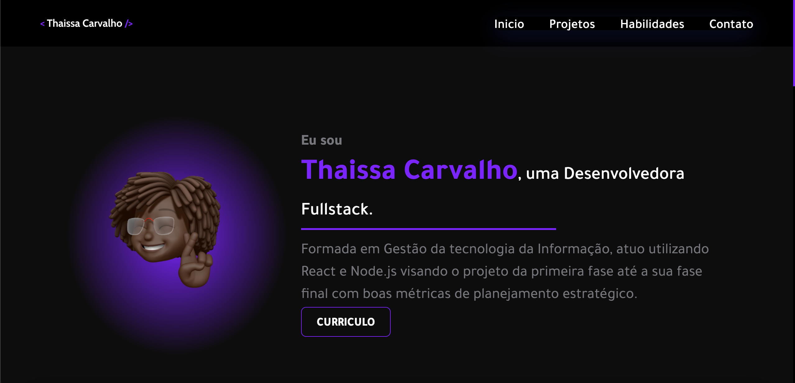

# Meu Portfolio ✨ 

SEJA BEM VINDO 
Este é o meu portfólio pessoal, onde você pode aprender mais sobre mim, explorar o meu currículo, conferir meus projetos mais recentes e entrar em contato comigo da maneira que preferir.

## Sobre Mim
Neste espaço, você encontrará informações relevantes sobre minha trajetória, formação acadêmica, experiência profissional e minhas áreas de especialização.

Tem um botão para o curriculo, caso você deseje uma visão detalhada do meu histórico acadêmico e profissional, pode fazer o download do meu currículo em PDF diretamente a partir do meu portfólio.

## Projetos 
Aqui, você pode conferir alguns dos meus projetos mais recentes. Cada projeto inclui uma breve descrição, tecnologias utilizadas e links para os repositórios no GitHub ou demonstrações online.

## Contato
Se você tem alguma pergunta, deseja discutir uma oportunidade de colaboração ou simplesmente deseja entrar em contato comigo, fique à vontade para escolher a maneira mais conveniente para você. Você pode me enviar um e-mail, conectar-se através das redes sociais e futuramente, você poderá preencher o formulário de contato no próprio site.

Este site foi projetado com o objetivo de tornar mais fácil para você conhecer minhas habilidades de programação de forma prática e eficaz. Sinta-se à vontade para explorar e entrar em contato. Estou ansioso para conectar e colaborar com você!

## Tecnologias Usadas

- Javascript
- React
- SASS
- Boostrap
- React-Boostrap
- Vite

- **E-mail:** thaissa-carvalho@outlook.com
- **LinkedIn:** [Seu Perfil no LinkedIn](https://www.linkedin.com/in/thaissa-carvalho-dev/)
- **GitHub:** [Seu Perfil no GitHub](https://github.com/thaissacarvalho)
